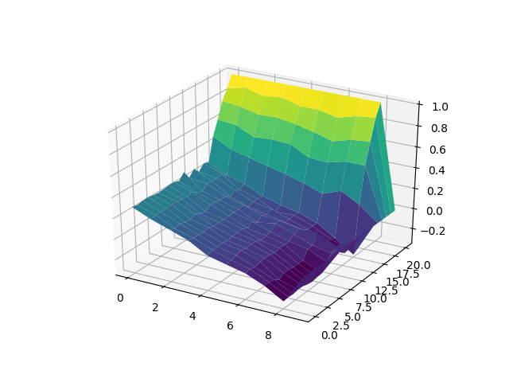
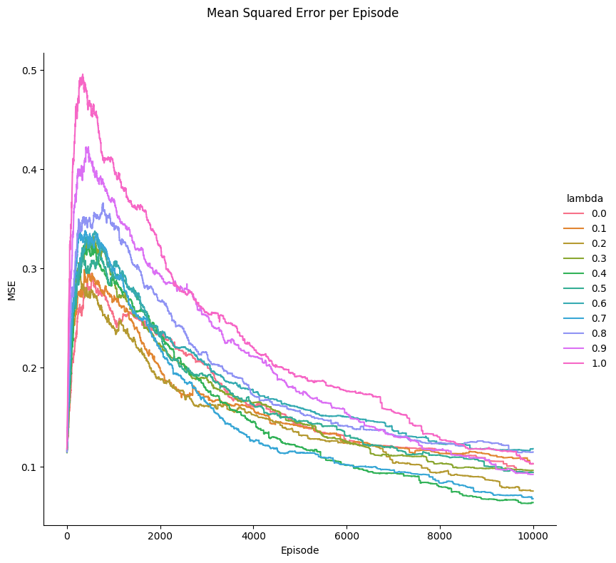
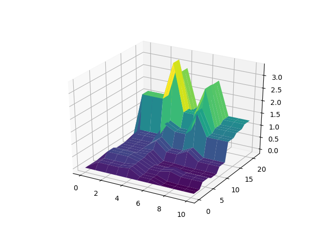
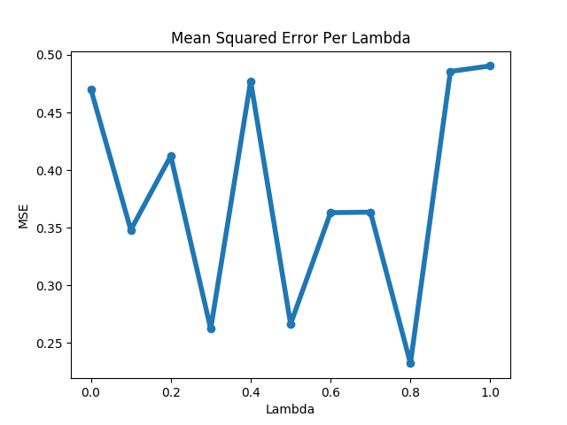
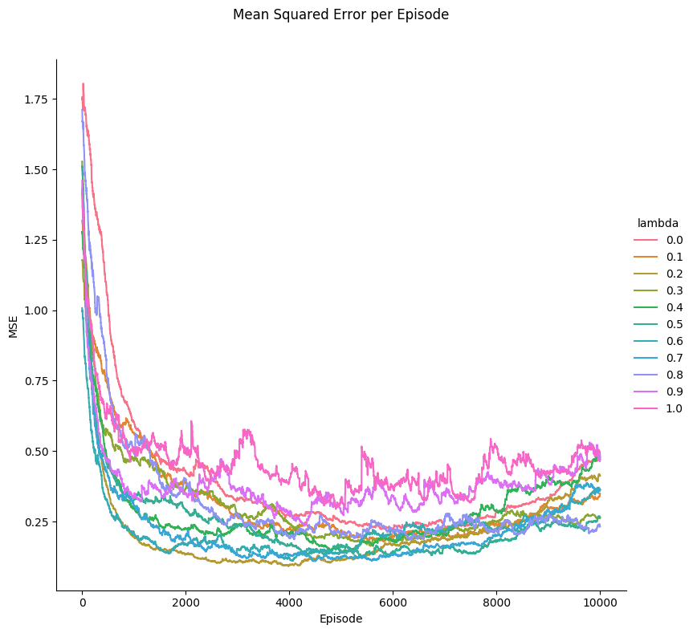

# Easy21 Game

## Monte-Carlo Control

Monte Carlo Surface Plot after 100K iterations

Monte Carlo Surface Plot after 1M iterations

## TD-Sarsa Learning

Mean squared error against lambda.

Mean squared error over all states and actions comparing the true Q computed using Monte-Carlo.

## Linear Function Approximation

LFA-Sarsa Surface Plot after 10K iterations

Mean squared error against lambda.

Mean squared error over all states and actions comparing the true Q computed using Monte-Carlo.

